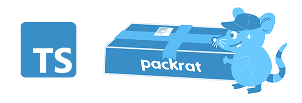

Instant typescript npm packages.



[](https://npmjs.org/package/ts-packrat)
[](https://npmjs.org/package/ts-packrat)
[](https://github.com/YizYah/ts-packrat/blob/master/package.json)


[//]: # ( ns__custom_start toc )
<!-- toc -->
* [:clipboard: Why](#why)
* [:bulb: What](#what)
* [:wrench: How](#how)
* [:heavy_exclamation_mark: Help](#help)
* [:eyes: See Also](#see-also)
<!-- tocstop -->

[//]: # ( ns__custom_end toc )

# :clipboard: Why
So you don't have to worry about anything but writing your TS code.  

# :bulb: What
**[Warning: still beta.]**

Your package is set up to work well for npm, with a reasonable configuration.  

* ts is set up
* menu-driven selection and updates of what type of interfaces, constants and functions you want to expose.
* option for groupings of constants and/or functions
* testing set up with ava, with default very high level testing in place already
* linting with eslint

And, we can handle the upgrades for all the packages that you don't add yourself.  This package uses **[ns-flip](https://www.npmjs.com/package/ns-flip)**. So, you can regenerate your code without losing your changes whenever `packrat` updates!

# :wrench: How
Follow the steps below.  
## (1) Create a Starter CLI
Define `$CODE_DIR` as the path to your desired directory for your package. Then run
```
npx packrat $CODE_DIR
```
and answer the interactive questions.

## (2) Update the Commands
Call 
```
npx ns-flip settings $CODE_DIR
```
and follow the prompts.

The `general` option is there if you want to change any of the interactive answers you gave in step 1.  The `static` option is what you need to choose now.  You can add one of two things:
1. __typeCategory__: a grouping for types of interfaces that you'll want to expose.  That's useful if you will want your package users to have access to your defined types.
2. __grouping__: a grouping for constants and/or functions that you want to expose.  
For each type of category or grouping, you can then add as many as you'd like.  If you give descriptions, it will all show up in your generated README file.

You will be prompted to regenerate your code after you make changes.  You can also call that separately:
```
npx ns-flip generate $CODE_DIR
```

## (3) Change the Custom Code
Of course, you still have to create your code.  You should be able to do just about anything possible in Node using Typescript.  But, follow the [safe custom code practices of ns-flip](https://ns-flip.nostack.net/Safe-Custom-Code) to be able to reapply this template in the future without losing anything.

For every grouping, you will see a generated file in `src/groupings`.  You can just define things there, but best is to create things in `src/custom` and then include them in the `helpers` section or require them directly.

## (4) Updating Your Template
Take a minute and set up alerts about releases to this template.
1. Go to the [GitHub repo](https://github.com/YizYah/ts-packrat) and click the arrow by the `Watch` button on the upper right.


2. Choose "Custom", and then select "Releases".


Before you update your template, check your code for safety by calling:
    ``` 
    npx ns-flip check $CODE_DIR
    ```
To reapply the template with a newly released version, just the first command again.  Make sure to use the same path for the legacy `$CODE_DIR`.
```
npx ns-flip settings $CODE_DIR
```
All of the settings and custom changes in the `$CODE_DIR` cli will be retained if you followed the [safe custom code practices of ns-flip](https://ns-flip.nostack.net/Safe-Custom-Code).

# :heavy_exclamation_mark: Help
We've started a [wiki](https://github.com/YizYah/ts-packrat/wiki), intended for someone new to npm and node.

Post on the [ns-flip Community](https://spectrum.chat/ns-flip?tab=posts).

# :eyes: See Also
[ns-flip documentation](https://ns-flip.nostack.net/Home)
